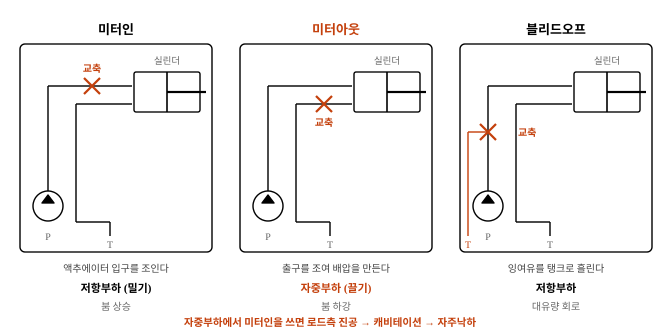
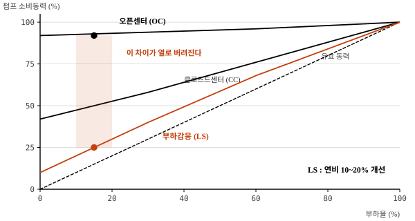

# 유압 밸브의 역할과 유량 제어 방식

meta: 014 | 서술형(25점) | 유압 시스템

## I. 개요

### 1. 유압 밸브의 정의
유압 회로에서 작동유의 **압력·유량·방향**을 조절하여 액추에이터의
힘·속도·운동방향을 제어하는 기기를 말한다.

### 2. 제어 3요소와 밸브의 대응

| 제어 대상 | 물리량 | 담당 밸브 | 건설기계에서의 의미 |
|---|---|---|---|
| **힘** | 압력 P | 압력 제어 밸브 | 굴착력 한계, 회로 보호 |
| **속도** | 유량 Q | 유량 제어 밸브 | 붐·암 동작 속도, 미세 조작성 |
| **방향** | 유로 전환 | 방향 제어 밸브 | 상승/하강, 전진/후진 |

> **답안 포인트** — "압력은 부하가 만들고 속도는 유량이 만든다"는 원리에서
> 밸브의 역할이 도출된다. 이 한 줄을 개요에 반드시 쓴다.

### 3. 건설기계에서 밸브 제어가 중요한 이유
굴삭기는 붐·암·버킷·선회·주행이 **동시에 서로 다른 부하로 움직인다.**
한 대의 펌프로 이를 감당하려면 밸브가 유량을 적절히 분배해야 하며,
부하가 낮은 쪽으로 유량이 몰리는 현상을 막는 것이 설계의 핵심이다.

## II. 유압 밸브의 분류

### 1. 압력 제어 밸브

| 종류 | 기능 | 건설기계 적용 |
|---|---|---|
| 릴리프 밸브 | 회로 최고압 제한 | 메인 회로 32~35 MPa 설정 |
| 리듀싱 밸브 | 분기 회로 감압 | 파일럿 회로 3.5~4.0 MPa |
| 시퀀스 밸브 | 동작 순서 제어 | 아웃트리거 순차 전개 |
| 카운터밸런스 밸브 | 자중 낙하 방지 | 붐 하강 속도 제어 |
| 언로드 밸브 | 무부하 운전 | 다단 펌프 저압측 방출 |

### 2. 방향 제어 밸브
- 스풀식 **4포트 3위치**가 표준. 중립 형식이 회로 성격을 결정한다.

| 중립 형식 | 특징 | 적용 |
|---|---|---|
| 올포트 블록(Closed) | 모든 포트 차단, 부하 유지 | 정용량 펌프 + 어큐뮬레이터 |
| 탠덤 센터 | 펌프만 탱크로 환류 | 유지 + 무부하 병행 |
| 오픈 센터 | 전 포트 연결, 무부하 | 기어펌프 회로 |

### 3. 유량 제어 밸브
- 교축(Throttle)에 의한 유량 조절이 기본이며, 회로상 설치 위치에 따라
  **미터인 / 미터아웃 / 블리드오프**로 나뉜다.

## III. 유량 제어 방식의 비교

| 구분 | 미터인 | 미터아웃 | 블리드오프 |
|---|---|---|---|
| 설치 위치 | 액추에이터 **입구** | 액추에이터 **출구** | 입구측 **분기** |
| 제어 원리 | 유입량 제한 | 유출량 제한(배압 형성) | 잉여유 탱크 방출 |
| 부하 방향 | 저항부하(밀어내기) | **자중부하(끌어내리기)** | 저항부하 |
| 자주낙하 방지 | 불가 | **가능** | 불가 |
| 회로 효율 | 낮음(잉여유 릴리프 방출) | 낮음 | **높음** |
| 발열 | 큼 | 가장 큼 | 작음 |
| 속도 정밀도 | 양호 | 양호 | 낮음(누설 영향) |
| 건설기계 적용 | 붐 상승 | **붐 하강, 암 인** | 대유량 저정밀 회로 |

### 왜 붐 하강에 미터아웃을 쓰는가
붐이 **자중으로 떨어지는 방향**에서는 미터인으로 유입량을 줄여도
실린더가 부하에 끌려 내려간다. 이때 로드측이 진공이 되어 **캐비테이션**과
동작 불안정이 발생한다. 출구를 조여 **배압을 형성**해야 비로소 속도가 제어된다.
카운터밸런스 밸브가 이 역할을 전담하는 경우도 많다.

## IV. 밸브 제어의 발전 — 오픈센터에서 부하감응으로

| 방식 | 제어 원리 | 잉여 동력 | 연비 |
|---|---|---|---|
| 오픈센터(OC) | 고정 토출, 중립 시 환류 | 릴리프로 열 방출 | 기준 |
| 클로즈드센터(CC) | 압력 보상 펌프 | 대기압 손실 | 기준 대비 개선 |
| **부하감응(LS)** | 최고 부하압 + Δp 만큼만 토출 | **최소** | **10~20% 개선** |

부하감응 회로는 각 스풀에서 가장 높은 부하압을 신호선으로 되돌려,
펌프가 그 압력보다 일정 차압(통상 1.5~2.0 MPa)만큼만 높게 토출하도록 한다.
불필요한 압력 차이가 사라져 **밸브에서 열로 버려지던 동력이 회수**된다.

## V. 문제점 및 대책

| 현상 | 원인 | 대책 |
|---|---|---|
| **스풀 고착** | 작동유 오염, 실리카·금속분 끼임 | NAS 9급 유지, 압력 필터 10㎛, 분해 세척 |
| 내부 누설 증가 | 스풀-보디 간극 마모 | 드리프트량 측정, 밸브 블록 교환 |
| 채터링(진동음) | 릴리프 스프링 공진, 배관 공진 | 파일럿형 채용, 배관 지지 보강 |
| 과열 | 릴리프 상시 작동, 교축 손실 | LS 회로 전환, 설정압 적정화 |
| 조작 지연 | 파일럿압 부족, 솔레노이드 불량 | 파일럿압 3.5 MPa 이상 확인 |
| 동시 조작 시 한쪽 정지 | 저부하측으로 유량 편중 | **압력 보상 밸브** 적용 |

### 압력 보상의 필요성
복합 동작 시 부하가 낮은 액추에이터로 유량이 쏠려 고부하측이 멈춘다.
스풀마다 압력 보상 밸브를 두어 **스풀 전후 차압을 일정하게 유지**하면,
부하 크기와 무관하게 스풀 개도에 비례한 유량이 분배된다.

## VI. 결론

1. 유압 밸브는 **압력·유량·방향의 3요소를 제어**하여 액추에이터의
   힘·속도·운동방향을 결정하는 회로의 두뇌에 해당한다.

2. 유량 제어는 부하 방향에 따라 방식을 달리해야 한다. 특히 **자중부하에서는
   미터아웃이 필수**이며, 미터인을 적용하면 캐비테이션과 자주낙하로
   제어가 불가능해진다. 이는 시공 안전과 직결되는 사항이다.

3. 밸브 고장의 대부분은 부품 결함이 아니라 **작동유 오염에 의한 스풀 고착**이다.
   정밀 간극이 수 ㎛ 수준이므로 청정도 관리가 곧 밸브 신뢰성 관리이다.

4. 향후 **전자비례 밸브와 부하감응 제어의 결합**이 표준이 되어,
   교축 손실을 최소화하면서 미세 조작성을 확보하는 방향으로 발전할 것이다.
   나아가 밸브를 거치지 않고 전동모터의 회전수로 유량을 직접 제어하는
   **전동 유압(EHA)** 방식이 소형 건설기계부터 적용될 것으로 사료된다.
