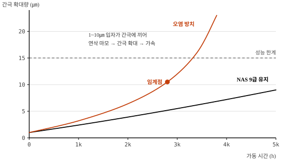

# 작동유 오염도 측정 및 관리 방안

meta: 016 | 서술형(25점) | 유압 시스템

## I. 개요

### 1. 오염 관리의 중요성
유압기기 고장의 **70~80%가 작동유 오염에 기인**한다. 건설기계는 분진·수분이
상존하는 옥외 현장에서 운용되므로, 오염 관리가 곧 가동률 관리이다.

### 2. 오염물의 분류

| 구분 | 종류 | 발생원 |
|---|---|---|
| 고체 오염 | 금속 마모분, 모래·먼지, 시일 파편 | 외부 유입, 내부 마모, 조립 시 잔류 |
| 액체 오염 | 수분, 이종유 혼입 | 결로, 쿨러 누수, 보충 시 혼유 |
| 기체 오염 | 혼입 공기 | 흡입측 누기, 탱크 유면 저하 |
| 화학적 열화 | 산화물, 슬러지, 첨가제 소모 | 고온 운전, 장기 사용 |

## II. 오염이 유발하는 고장 메커니즘

```
   정밀 간극부(펌프 슈, 스풀 밸브)의 간극  :  1 ~ 10 ㎛
   ────────────────────────────────────────────────────

    입자 크기         거동                결과
   ───────────────────────────────────────────────────
    < 1 ㎛      간극 통과              영향 미미
    1 ~ 10 ㎛   ██ 간극에 끼임 ██      ← 가장 위험
                → 연삭 마모 → 간극 확대
                → 더 큰 입자 유입 → 가속 열화
    > 10 ㎛     필터에 포집            필터 차압 상승
```

**핵심** : 눈에 보이는 큰 입자가 아니라 **1~10 ㎛의 보이지 않는 입자**가
정밀 간극을 갉아 연쇄적 열화를 일으킨다. 육안 점검만으로는 결코 알 수 없다.

### 연쇄 열화 곡선




## III. 오염도 측정 방법

### 1. 정량적 방법

| 방법 | 대상 | 판정 기준 | 비고 |
|---|---|---|---|
| **입자계수(자동계수기)** | 고체 입자 | ISO 4406 코드 / NAS 등급 | 가장 정확, 표준 방법 |
| 중량법 | 총 고체량 | mg/100mℓ | 간이·저가 |
| 페로그래피 | 마모분 형태·재질 | 마모 유형 판별 | 고장 원인 추적 |
| 수분 측정(칼피셔) | 수분 함량 | **0.1%(1000 ppm) 이하** | 정밀 |
| 점도 측정 | 열화도 | 신유 대비 ±10% 이내 | |
| 산가(TAN) | 산화 열화 | 신유 대비 +0.5 mgKOH/g 이내 | |

### 2. ISO 4406 코드 체계

```
   ISO 4406 :  18 / 16 / 13
               ─┬─  ─┬─  ─┬─
                │    │    └── ≥14㎛ 입자수 등급
                │    └─────── ≥6㎛  입자수 등급
                └──────────── ≥4㎛  입자수 등급

   등급 : 1mℓ 당 입자 수를 2의 거듭제곱 구간으로 표현
          (등급 1 증가 = 입자 수 2배)

   예)  16급 = 320 ~ 640 개/mℓ
        18급 = 1300 ~ 2500 개/mℓ
```

### 3. NAS 1638 등급과 관리 기준

| NAS 등급 | ISO 4406 상당 | 적용 대상 |
|---|---|---|
| NAS 6 | 15/13/10 | 서보밸브 정밀 회로 |
| NAS 8 | 18/16/13 | 비례제어 회로 |
| **NAS 9** | **20/18/15** | **건설기계 일반 회로(권장 관리값)** |
| NAS 10 | 21/19/16 | 허용 한계 |
| NAS 11 이상 | 22/20/17 | **즉시 조치 필요** |

### 4. 현장 간이 점검법

| 항목 | 방법 | 판정 |
|---|---|---|
| 색상 | 채유 후 육안 | 유백색 → **수분 혼입** / 흑갈색 → 열화·과열 |
| 냄새 | 후각 | 탄내 → 과열 열화 |
| 수분 | **크래클 시험**(120℃ 철판에 적하) | "탁" 소리·기포 → 수분 존재 |
| 침전물 | 투명 용기 24h 정치 | 바닥 침전 → 고체 오염 |
| 필터 차압 | 차압 지시계 | 적색역 → 필터 막힘 |

> **답안 포인트** — 크래클 시험은 장비 없이 현장에서 수분을 잡아내는 방법으로,
> 실무 경험을 드러내기 좋은 항목이다. 반드시 언급한다.

## IV. 오염 방지 및 관리 대책

### 1. 발생원 차단
- 급유 시 **전용 여과 급유기** 사용 (드럼에서 직접 보충 금지)
- 탱크 **브리더 필터** 설치 (여과도 10㎛), 정기 교환
- 호스·배관 교체 시 개구부 즉시 캡 처리
- 실린더 로드 **와이퍼 시일** 주기 점검 (외부 분진 유입 1차 방어선)

### 2. 여과 시스템

```
   ┌──탱크──┐
   │ 브리더 │← 대기 중 분진 차단 (10㎛)
   │  필터  │
   │        │
   │ ┌────┐ │
   │ │스트││← 흡입 스트레이너 100~150㎛ (펌프 보호, 캐비테이션 주의)
   │ └──┬─┘ │
   └────┼───┘
        ▼
     [ 펌프 ]
        │
        ▼
   ┌─────────┐
   │압력 필터│← 10㎛, 밸브 직전 (정밀기기 보호)
   └────┬────┘
        ▼
     액추에이터
        │
        ▼
   ┌─────────┐
   │리턴 필터│← 10~25㎛ + 바이패스 밸브 (마모분 최종 포집)
   └────┬────┘
        ▼
       탱크
```

### 3. 주기적 관리

| 항목 | 주기 | 기준 |
|---|---|---|
| 오일 레벨·육안 | 매일(일상점검) | 유면, 색상, 유화 여부 |
| 필터 차압 확인 | 매주 | 지시계 적색역 진입 시 교환 |
| 리턴 필터 교환 | 500 h | 또는 차압 경보 시 |
| 오일 분석(SOS) | 1,000 h | NAS 등급, 수분, 점도, 산가 |
| 작동유 교환 | 2,000 h | 분석 결과에 따라 연장 가능 |

### 4. 플러싱
오일 교환·오버홀 후에는 반드시 플러싱을 시행한다.
- 저점도 플러싱유로 **난류 유동**(Re > 4000) 형성하여 관벽 부착물 제거
- 목표 청정도 도달까지 순환 후 배유, 필터 동시 교환

## V. 결론

1. 작동유 오염은 **육안으로 보이지 않는 1~10 ㎛ 입자**가 주범이며,
   ISO 4406 / NAS 등급에 의한 정량 관리 없이는 통제가 불가능하다.
   건설기계 일반 회로는 **NAS 9급 이내** 유지를 목표로 한다.

2. 오염 관리는 사후 교환이 아니라 **발생원 차단 + 다단 여과 + 정기 분석**의
   3중 체계로 접근해야 하며, 특히 급유·정비 시의 관리 수준이 결과를 좌우한다.

3. 시간 기준 교환(TBM)에서 **오일 분석 기반 상태기준 정비(CBM)** 로 전환하면,
   불필요한 교환을 줄여 정비비를 절감하는 동시에 폐유 발생량을 감소시켜
   환경 측면에서도 유리하다. 텔레매틱스와 연계한 온라인 오염도 센서의
   적용 확대가 향후 방향이라 판단된다.
