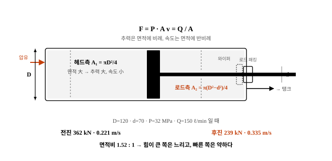
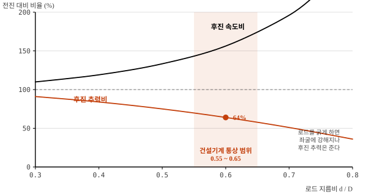

# 유압 실린더의 구조와 작동원리

meta: 019 | 서술형(25점) | 유압 시스템

## I. 개요

### 1. 정의
작동유의 **압력에너지를 직선 왕복운동의 기계에너지로 변환**하는 액추에이터로,
굴삭기의 붐·암·버킷, 도저의 블레이드, 크레인의 아웃트리거를 구동한다.

### 2. 건설기계에서의 위치
- 유압 회로의 **최종 출력단** — 앞단의 모든 손실이 여기서 성능으로 드러난다
- 굴삭기 1대에 붐 2개, 암 1개, 버킷 1개 등 **5~7개**가 장착된다
- 작업 중 상시 편심·충격 하중을 받아 **고장 시 즉시 작업 중단**으로 이어진다

## II. 구조 및 작동원리



### 1. 주요 구성 부품

| 부품 | 기능 | 주요 손상 |
|---|---|---|
| 실린더 튜브 | 압력 용기, 피스톤 안내 | 내면 긁힘, 배럴 팽창 |
| 피스톤 | 압력을 받아 추력 발생 | 피스톤 시일 마모 → 내부 누설 |
| 피스톤 로드 | 추력 전달 | 굽힘, 크롬 도금 박리 |
| 로드 패킹(U-패킹) | 외부 누유 방지 | 경화·마모 → 누유 |
| 더스트 와이퍼 | 외부 분진 유입 차단 | 손상 시 작동유 오염 가속 |
| 쿠션 기구 | 행정 말단 충격 흡수 | 쿠션 조정 불량 시 타격음 |

### 2. 작동 원리
방향제어밸브가 유로를 전환하면 한쪽 포트로 압유가 유입되고
반대쪽은 탱크로 환류하여 피스톤이 이동한다.

```
  [전진(밀기)]                        [후진(당기기)]
  압유 → 헤드측                       압유 → 로드측
  로드측 → 탱크                       헤드측 → 탱크
```

### 3. 단동식과 복동식

| 구분 | 단동식 | 복동식 |
|---|---|---|
| 복귀 방식 | 자중 또는 스프링 | 유압 |
| 포트 수 | 1개 | 2개 |
| 적용 | 덤프트럭 호이스트 | **건설기계 작업장치 전반** |

## III. 추력과 속도 — 면적차가 만드는 비대칭

### 1. 지배 방정식

| 항목 | 전진(헤드측 가압) | 후진(로드측 가압) |
|---|---|---|
| 수압 면적 | A₁ = πD²/4 | A₂ = π(D²−d²)/4 |
| 추력 | F₁ = P·A₁ | F₂ = P·A₂ |
| 속도 | v₁ = Q/A₁ | v₂ = Q/A₂ |

D : 실린더 내경, d : 로드 지름

### 2. 계산 예 (D = 120 mm, d = 70 mm, P = 32 MPa, Q = 150 ℓ/min)

| 항목 | 전진 | 후진 | 비 |
|---|---|---|---|
| 면적 | 113.1 cm² | 74.6 cm² | 1.52 : 1 |
| 추력 | **362 kN** | 239 kN | 1.52 : 1 |
| 속도 | 0.221 m/s | **0.335 m/s** | 1 : 1.52 |

**추력이 큰 쪽은 느리고, 빠른 쪽은 힘이 약하다.** 굴삭기가 굴착(당기기)보다
밀어내기에서 큰 힘을 내는 것, 반대로 복귀가 빠른 것이 이 면적차 때문이다.



### 3. 면적비 선정
- 로드 지름비 d/D 를 키우면 후진 추력은 줄지만 **좌굴 강도가 커진다**
- 건설기계는 통상 d/D = 0.55~0.65 를 적용하여 강도와 성능을 절충한다

## IV. 쿠션 기구

행정 말단에서 피스톤이 커버를 때리면 충격압이 수십 MPa에 달해
로드 굽힘과 용접부 균열을 유발한다.

```
   쿠션 링이 배출구를 막기 전          쿠션 링 진입 후
   ┌──────────────────────┐        ┌──────────────────────┐
   │ ▓▓▓  →→→  대유량 배출 │        │ ▓▓▓│ 교축 통로로만 배출 │
   └──────────────────────┘        └──────────────────────┘
        빠른 속도                        감속 → 부드러운 정지
```

- 쿠션 니들로 교축량을 조절한다. 너무 조이면 행정 완주 불가,
  너무 열면 충격음 발생 — **타격음이 들리면 즉시 조정**한다.

## V. 문제점 및 대책

| 현상 | 원인 | 대책 |
|---|---|---|
| **자주 낙하(드리프트)** | 피스톤 시일 파손, 홀딩밸브 누설 | 배관 차단 시험으로 부위 판별, 시일 교환 |
| 외부 누유 | 로드 패킹 경화, 로드 표면 손상 | 패킹 교환, 로드 크롬 재도금 |
| 로드 굽힘 | 편심 하중, 측압, 좌굴 | 작업 자세 준수, 오일러 좌굴 검토 |
| 크롬 박리·발청 | 비산물 타격, 장기 노출 | 장기 주차 시 **로드 완전 수축** 보관 |
| 내부 누설 증가 | 튜브 내면 마모, 배럴 팽창 | 추력 실측(규정치의 90% 미만 시 오버홀) |
| 이상 소음·떨림 | 공기 혼입, 캐비테이션 | 에어빼기, 흡입계통 기밀 점검 |

### 좌굴(Buckling) 검토
로드는 압축 하중을 받는 장주(長柱)이므로 오일러 좌굴 검토가 필수다.

```
   Pcr = π²·E·I / (L_k)²      I = πd⁴/64
   E : 종탄성계수, L_k : 좌굴 길이(지지 조건에 따라 결정)
   안전율 3.5 이상 확보 — 스트로크가 길수록 로드 지름을 키워야 한다
```

### 장기 보관 시 로드를 수축시키는 이유
노출된 로드 표면은 비·먼지에 그대로 노출되어 **발청과 크롬 박리**가
진행되고, 재가동 시 그 손상면이 패킹을 갉아 누유의 시발점이 된다.
현장에서 지켜지지 않는 항목 1순위이므로 점검표에 명문화해야 한다.

## VI. 결론

1. 유압 실린더는 압력에너지를 직선운동으로 바꾸는 최종 출력단으로,
   **추력 F = P·A, 속도 v = Q/A** 의 단순한 관계가 모든 성능을 지배한다.

2. 헤드측과 로드측의 **면적차로 인해 전·후진 성능이 비대칭**이며,
   이 특성이 굴삭기의 굴착력과 복귀 속도를 결정한다. 설계 시에는
   좌굴 강도까지 고려하여 로드 지름비를 d/D = 0.55~0.65 로 절충한다.

3. 실무 고장의 대부분은 **시일 계통과 로드 표면 관리**에서 비롯된다.
   특히 장기 주차 시 로드를 수축시키는 단순한 조치만으로도
   누유 발생을 크게 줄일 수 있으나 현장에서 가장 지켜지지 않는 항목이다.

4. 향후 **위치 센서 내장형 실린더(스마트 실린더)** 의 적용이 확대되어
   머신 컨트롤(MC/MG) 시스템과 연동한 자동 정밀 시공이 일반화될 것이며,
   내장 센서로 드리프트량을 상시 감시하여 시일 열화를 예지하는
   상태기반 정비로 발전할 것으로 판단된다.
