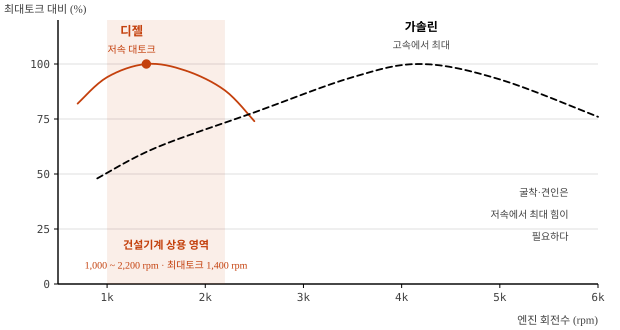

# 디젤엔진과 가솔린엔진의 비교

meta: 022 | 서술형(25점) | 엔진 및 파워트레인

## I. 개요

### 1. 비교의 실익
건설기계는 **예외 없이 디젤엔진**을 채용한다. 그 이유를 열역학 사이클과
성능 특성으로 설명할 수 있어야, 배출가스 규제 대응과 전동화 논의의
출발점을 잡을 수 있다.

### 2. 근본적 차이 — 착화 방식

| 구분 | 디젤엔진 | 가솔린엔진 |
|---|---|---|
| 착화 | **압축착화**(자기착화) | 전기점화(스파크) |
| 혼합기 형성 | 실린더 내 직접분사(불균질) | 흡기관·실린더 내 예혼합(균질) |
| 부하 제어 | **연료량**(공기량 일정) | 흡입 공기량(스로틀) |
| 압축비 | 15 ~ 22 : 1 | 8 ~ 12 : 1 |
| 공기과잉률 λ | 1.2 ~ 6 (희박) | 약 1.0 (이론공연비) |

> **답안 포인트** — 모든 차이는 "압축착화 vs 전기점화"와 "질적 제어 vs
> 양적 제어" 두 가지에서 파생된다. 이 구조로 서술하면 답안이 흩어지지 않는다.

## II. 열역학 사이클 비교


### 1. 사이클과 열효율

| 사이클 | 연소 과정 | 이론 열효율 |
|---|---|---|
| 오토(정적) | 정적 가열 | η = 1 − (1/ε)^(k−1) |
| 디젤(정압) | 정압 가열 | η = 1 − (1/ε)^(k−1) · [(σ^k−1)/(k(σ−1))] |
| 사바테(복합) | 정적 + 정압 | 실제 고속 디젤의 거동 |

ε : 압축비, σ : 체절비, k : 비열비(≈1.4)

### 2. 디젤이 효율에서 앞서는 이유
같은 압축비라면 정적 사이클이 유리하지만, 가솔린엔진은 **노킹 때문에
압축비를 12 이상 올릴 수 없다.** 디젤은 공기만 압축하므로 노킹 제약이 없어
압축비 20 내외를 쓸 수 있고, 그 차이가 효율 역전을 만든다.

| 항목 | 디젤 | 가솔린 |
|---|---|---|
| 정미 열효율 | **40 ~ 45%** | 25 ~ 35% |
| 연료 소비율(BSFC) | **190 ~ 230 g/kWh** | 250 ~ 320 g/kWh |
| 연료 저위발열량 | 42.7 MJ/kg | 44.0 MJ/kg |
| 연료 밀도 | 0.83 kg/ℓ | 0.75 kg/ℓ |

연료 자체의 발열량은 가솔린이 약간 높지만, **밀도가 높아 단위 부피당
에너지는 디젤이 크고**, 여기에 열효율 차이가 더해져 연비 격차가 벌어진다.

## III. 성능 특성 비교



| 항목 | 디젤 | 가솔린 |
|---|---|---|
| 최대토크 발생 | **저속(1,200~1,600 rpm)** | 중·고속(3,000~4,500 rpm) |
| 최고 회전수 | 2,200 ~ 2,500 rpm | 6,000 rpm 이상 |
| 리터당 출력 | 낮음 | 높음 |
| 저속 토크 | **큼** | 작음 |
| 기관 중량 | 무거움(고압 대응 구조) | 가벼움 |
| 내구 수명 | **길다(1만 시간 이상)** | 짧다 |

### 건설기계가 디젤을 쓰는 이유

1. **저속 대토크** — 굴착·견인은 저속에서 최대 힘이 필요하다
2. **연비** — 하루 8~10시간 연속 가동에서 연료비가 운영비를 지배한다
3. **내구성** — 정비 주기를 길게 가져가야 가동률이 확보된다
4. **연료 안전성** — 인화점이 높아(55℃ 이상) 현장 보관·취급이 안전하다
5. **거버너 제어** — 부하 변동에도 회전수를 유지해 작업 속도가 일정하다

## IV. 배출가스 특성과 규제 대응

### 1. 배출물의 상반된 구조

| 배출물 | 디젤 | 가솔린 | 생성 원인 |
|---|---|---|---|
| **NOx** | 많음 | 적음 | 고온·고산소 분위기 |
| **PM(매연)** | 많음 | 적음 | 국부적 농후 연소 |
| CO | 적음 | 많음 | 산소 부족 |
| HC | 적음 | 많음 | 미연소 연료 |
| CO₂ | **적음** | 많음 | 연비에 비례 |

### 2. NOx-PM 트레이드오프

```
  PM
   ▲
   │╲
   │ ╲   ← 연소온도를 낮추면 PM 증가
   │  ╲
   │   ╲___
   │       ╲────  트레이드오프 곡선
   │            ╲
   └──────────────────▶ NOx
        연소온도를 높이면 NOx 증가

  · 엔진 내부 제어만으로는 두 가지를 동시에 줄일 수 없다
  · 후처리(DPF + SCR)가 필수가 된 근본 이유
```

### 3. 규제 대응 기술

| 대상 | 기술 | 원리 |
|---|---|---|
| NOx 저감 | **Cooled EGR** | 배기 재순환으로 연소 최고온도 저하 |
| NOx 저감 | **SCR** | 요소수(DEF) 분사 → NH₃ 로 환원 |
| PM 저감 | **DPF** | 월플로우 포집 후 연소 재생 |
| CO·HC | DOC | 산화촉매 |
| 연소 개선 | **커먼레일** | 180 MPa 이상 다단분사로 연소 최적화 |

가솔린엔진은 이론공연비 운전이 가능하여 **삼원촉매 하나로** CO·HC·NOx를
동시 정화할 수 있으나, 디젤은 희박연소라 삼원촉매를 쓸 수 없다.
이것이 디젤 후처리 장치가 복잡하고 고가인 이유다.

## V. 문제점 및 대책

| 문제 | 원인 | 대책 |
|---|---|---|
| 저온 시동 곤란 | 압축열 부족, 연료 왁스화 | 예열플러그, 동절기용 경유, 블록히터 |
| 소음·진동 | 급격한 압력 상승(디젤 노크) | 파일럿 분사, 방진 마운트 |
| 커먼레일 인젝터 고장 | **연료 오염**(수분·이물) | 워터세퍼레이터 매일 배출, 필터 주기 엄수 |
| DPF 재생 실패 | 저속·공회전 위주 운전 | 주기적 고부하 운전, 공회전 저감 |
| 요소수 결정화 | 분사 노즐 막힘 | 규정 DEF 사용, 정기 점검 |

## VI. 결론

1. 디젤과 가솔린의 차이는 **압축착화와 전기점화**, 그리고 **질적 제어와
   양적 제어**라는 두 축에서 모두 파생된다. 이 구조를 잡으면 효율·토크·
   배출 특성의 차이가 일관되게 설명된다.

2. 건설기계가 디젤을 채용하는 이유는 단순한 연비가 아니라,
   **저속 대토크·내구성·연료 취급 안전성**이 현장 조건에 부합하기 때문이다.

3. 디젤의 약점인 **NOx-PM 트레이드오프**는 엔진 내부 제어만으로 해결할 수
   없어 DPF·SCR 후처리가 필수가 되었고, 이로 인해 기체 가격과 정비
   복잡도가 크게 상승했다. Stage V 이후 이 부담은 더 커질 전망이다.

4. 따라서 규제가 강화될수록 **후처리 고도화의 한계 비용**이 전동화 비용을
   상회하는 지점이 다가오고 있으며, 도심·실내·터널 작업을 중심으로
   배터리 전동 건설기계로의 전환이 먼저 일어날 것으로 사료된다.
   중대형 장비는 당분간 디젤이 유지되되 **하이브리드(에너지 회생)** 적용이
   확대되는 이원화 구도가 상당 기간 지속될 것으로 판단된다.
