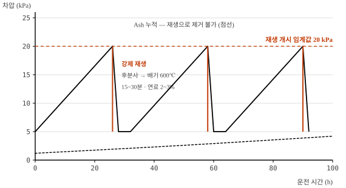

# 디젤 미립자 필터(DPF)의 작동원리와 관리

meta: 105 | 서술형(25점) | 최근 빈출

## I. 개요

### 1. 정의
디젤엔진 배기 중의 **입자상물질(PM)을 물리적으로 포집**하고, 축적된 PM을
연소시켜 제거(재생)하는 배기 후처리 장치이다.

### 2. 도입 배경
- **대기환경보전법** 및 건설기계 배출가스 규제(Tier-4 / Stage IV 이상) 대응
- 수도권 등 **배출가스 5등급 건설기계 운행 제한** 정책
- 저공해 조치 명령 대상 장비의 DPF 부착 지원사업 시행
- PM은 WHO 지정 1급 발암물질 — 저감 필요성이 사회적으로 확립

### 3. PM의 구성

| 성분 | 비율 | 특성 |
|---|---|---|
| Soot(매연, 탄소) | 50~70% | **DPF 재생으로 연소 제거 가능** |
| SOF(가용성 유기물) | 20~40% | 미연 연료·윤활유 기인 |
| Sulfate(황산염) | 5~10% | 연료 중 황분 기인 |
| Ash(회분) | 1~5% | **연소되지 않음 → 누적** |

## II. 구조 및 포집 원리

### 1. 월플로우(Wall-flow) 구조


### 2. 전체 후처리 계통

```
  엔진 ──▶ [DOC] ──▶ [DPF] ──▶ [SCR] ──▶ 대기
            │          │         │
        산화촉매    PM 포집    요소수(DEF)
        CO·HC 산화  + 재생     분사 → NOx 환원
        NO→NO₂ 생성            → N₂ + H₂O
        (재생 보조)
```

## III. 재생(Regeneration) 방식

### 1. 자연 재생 (수동적 재생)

```
   NO₂ + C  →  NO + CO     (250~400℃ 에서 진행)

   · DOC에서 생성된 NO₂가 산화제로 작용
   · 별도 연료 소모 없음 — 가장 이상적
   · 조건 : 배기온도 250℃ 이상이 지속되어야 함
```

### 2. 강제 재생 (능동적 재생)




| 재생 유형 | 조건 | 운전자 조치 |
|---|---|---|
| 자동 재생 | 주행·작업 중 자동 수행 | 없음 (계기판 표시만) |
| **수동 재생** | 자동 재생 실패 누적 | 안전지대 정차 후 스위치 조작, 20~30분 대기 |
| 정비소 재생 | 수동 재생도 실패 | 진단기 강제 재생 또는 필터 탈거 세척 |

## IV. 문제점 및 대책

| 현상 | 원인 | 대책 |
|---|---|---|
| **재생 빈발** | 저속·공회전 위주 작업, 배기온도 미달 | 주기적 고부하 운전, 공회전 저감 |
| 재생 실패 반복 | 차압센서 불량, 연료 후분사 계통 이상, DOC 열화 | 고장코드 판독, 차압센서 배관 막힘 점검 |
| 엔진오일 증가·희석 | 후분사 연료가 실린더 벽 타고 오일팬 유입 | **오일 레벨 상한 초과 시 즉시 교환** |
| 차압 상승(재생 무효) | **Ash 누적** (연소 불가 성분) | 3,000~5,000 h 마다 **필터 탈거 세척** |
| 출력 저하·경고등 | 과도 퇴적로 인한 출력 제한 모드 진입 | 강제 재생 후 원인 규명 |

### Ash 관리 — 재생으로 해결되지 않는 유일한 항목

```
  퇴적량
   ▲
   │        Soot (재생으로 제거)
   │      ╱╲    ╱╲    ╱╲    ╱╲
   │     ╱  ╲  ╱  ╲  ╱  ╲  ╱  ╲
   │    ╱    ╲╱    ╲╱    ╲╱    ╲
   │───┴──────────────────────────── 
   │▒▒▒▒▒▒▒▒▒▒▒▒▒▒▒▒▒▒▒▒▒▒▒▒▒▒▒▒▒▒▒  Ash (계속 누적)
   └────────────────────────────────▶ 가동시간
                                  ▲
                            탈거 세척 필요

  · Ash 발생원 : 엔진오일 첨가제(Ca, Zn, P), 연료 황분, 마모분
  · 대책 : 저회분(Low-SAPS) 엔진오일 사용, 초저황 경유 사용
```

## V. 관련 법규 및 실무

| 항목 | 내용 |
|---|---|
| 근거 법령 | 대기환경보전법, 수도권 대기환경개선에 관한 특별법 |
| 등급 산정 | 건설기계 배출가스 등급제 (1~5등급) |
| 저공해 조치 | 5등급 장비 → DPF 부착, 엔진 교체, 조기 폐차 중 택일 |
| 지원 | 부착 비용 국고·지자체 보조 (자기부담 최소화) |
| 사후 관리 | 부착 후 **3년간 성능 유지 의무**, 정기 확인검사 |
| 미이행 시 | 운행 제한, 과태료 부과 |

## VI. 결론

1. DPF는 월플로우 구조로 PM을 **물리적으로 포집**하고 산화 반응으로
   제거하는 장치로, 포집효율 90% 이상을 달성하는 검증된 기술이다.

2. 그러나 DPF는 "달면 끝"이 아니라 **배기온도 확보가 전제**되는 장치이다.
   저속·공회전 위주의 건설기계 작업 패턴은 자연 재생 조건을 만족시키기
   어려우므로, **운전 패턴 개선과 주기적 고부하 운전**이 반드시 병행되어야 한다.

3. 재생으로 제거되지 않는 **Ash는 필연적으로 누적**되므로, 저회분 엔진오일
   사용과 3,000~5,000 시간 주기의 탈거 세척을 정비 계획에 반영해야 한다.

4. Stage V에서 입자 **개수(PN)** 규제가 도입되면서 DPF는 선택이 아닌
   필수가 되었다. 향후에는 DPF·SCR 통합 모듈(SDPF) 및 전동화 건설기계로의
   전환이 근본적 해법이 될 것으로 판단되며, 과도기에는 기존 장비의
   저공해 조치와 적정 사후관리가 현실적 대안이라 사료된다.
