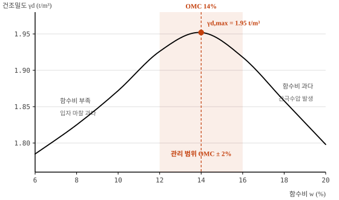

# 모범답안 작성 규약

기술사 시험은 답을 찾는 시험이 아니라 **외워서 쓰는 시험**이다.
그래서 답안 틀과 키워드만으로는 부족하고, 실제로 옮겨 쓸 수 있는 전문이 필요하다.

## 파일 규칙

- 파일명 = `<문항 id>.md` (덱의 id와 정확히 일치. 예: `011.md`)
- 첫 줄 : `# 답안 제목`
- 둘째 블록 : `meta: <id> | <유형> | <분야>`
  - 유형·분야는 `exam_deck.yaml` 의 `type` / `category` 와 일치해야 한다 (테스트가 검사)

```markdown
# 건설기계 유압시스템의 기본 원리

meta: 011 | 서술형(25점) | 유압 시스템
```

## 분량 — A4 · 글씨크기 10pt 기준

| 유형 | 배점 | 목표 분량 |
|---|---|---|
| 용어형 | 10점 (1교시) | **0.8 ~ 1.6장** |
| 서술형 | 25점 (2~4교시) | **3.0 ~ 4.5장** |

분량은 글자 수가 아니라 **줄 수**로 잰다. 표와 도해는 글자가 적어도 지면을
그대로 먹기 때문이다. `a3/answers.py` 의 `count_lines()` 가 폭 90(한글 45자),
장당 42줄 기준으로 계산하며, 범위를 벗어나면 테스트가 실패한다.

```bash
python -m a3 answers          # 전체 목록과 분량
python -m a3 answer 011       # 전문 보기
```

## 필수 구성

1. **대단원은 로마숫자** `## I. 개요` … `## VI. 결론` — 순서대로, 건너뛰지 않는다
2. **첫 장은 개요, 마지막 장은 결론** — 기술사 답안의 채점 골격
3. **표 3개 이상** — 비교·기준값·원인대책은 반드시 표로
4. **도해 2개 이상** — 코드펜스 안에 ASCII 도해

## 그림은 코드로 그린다

인터넷에서 그림을 가져오지 않는다. 교재·제조사 도해는 저작권이 있고,
자료함 페이지는 보안 정책상 **외부 이미지를 차단**해서 렌더링 자체가 안 된다.

대신 `tools/build_figures.py` 에서 SVG 를 생성한다.

```bash
python tools/build_figures.py      # a3/data/answers/figures/*.svg 재생성
```

마크다운에서는 이렇게 참조한다. 캡션에 **무엇을 보여주는 그림인지** 쓴다.

```markdown

```

### 그림을 그릴 때

`a3/figures.py` 의 `Fig`(구조도)와 `Plot`(선도)을 쓴다.

- **색은 두 가지만.** 구조선·글자는 `currentColor`(테마 전경색 상속),
  강조는 `var(--fig-accent)`. 색을 박아 쓰면 다크모드에서 안 보인다.
- **모든 축 눈금에 실제 수치.** "압력 높음"이 아니라 "32~35 MPa".
- **한 그림에 한 주장.** 캡션이 그 주장을 문장으로 말한다.
- 곡선은 `Plot.curve()` — Catmull-Rom 으로 점을 실제로 지나간다.
  제어점을 수평으로 두면 봉우리가 평평해져 다짐곡선이 다짐곡선처럼 안 보인다.

테스트가 검사하는 것: 참조한 SVG 파일의 존재, 그림 번호 순서,
캡션이 12자 이상인지, `currentColor` 사용 여부, `role="img"`/`aria-label`,
외부 리소스(`<script>`, `<image>`, `href="http`) 미포함.

### ASCII 도해는 언제 남기나

순서도와 단순 분기도는 ASCII 가 오히려 읽기 쉽고 유지보수도 편하다
(예: 053 의 고장진단 플로우). **곡선 그래프와 기계 구조도는 반드시 SVG** 로 그린다.
ASCII 로는 형상이 뭉개져 알아볼 수 없다.

## 내용 지침

- 수치·기준값을 반드시 넣는다. "적정 압력" 이 아니라 "32~35 MPa"
- 법규명·규격번호를 정확히 (ISO 4406, NAS 1638, 대기환경보전법, Stage V)
- 결론은 3~4개 항으로, 마지막 항에 **기술 동향과 본인 소견**
- `> **답안 포인트**` 인용구로 시험장에서 놓치기 쉬운 지점을 짚는다

## 진행 상황

서술형 83문항이 대상이다. 주간 루틴이 매주 3편씩 추가한다.
